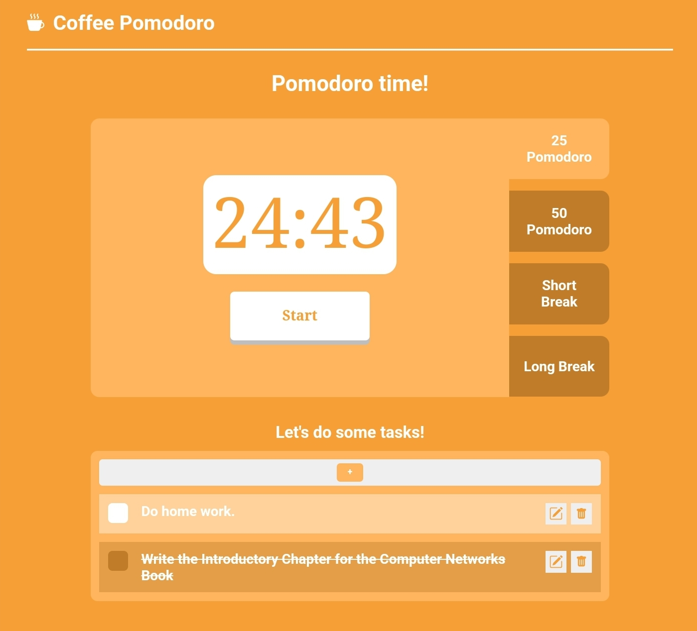
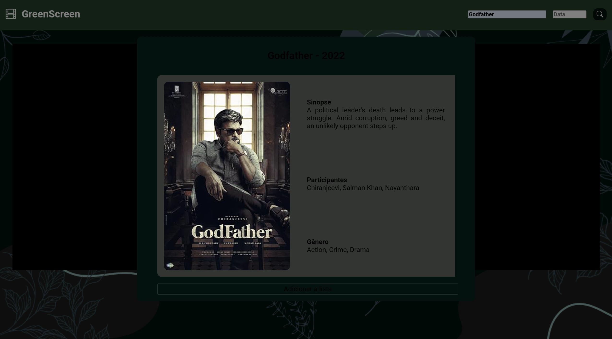

# Personal Web Projects

Welcome to my **personal web projects**! This repository contains various web development projects that I have built to enhance my skills in front-end technologies.

## Table of Contents
- [Coffee Pomodoro](#coffee-pomodoro)
- [Cine Verde](#cine-verde)

---

## Web Development Projects

### [Coffee Pomodoro](#coffee-pomodoro)
A Pomodoro timer designed for students who want to organize their time effectively. **Coffee Pomodoro** features a countdown timer for Pomodoro sessions, break times, and a to-do list for task organization.

  

### Topics Learned
- DOM Manipulation
- Timer management (Pomodoro, intervals, dates, and times)
- Dynamic style manipulation
- Modularization
- Input validation
- Task management

---

### [Cine Verde](#cine-verde)
**Cine Verde** is a movie catalog website that allows users to create personalized movie lists, filter films by release date, and explore their favorite movies in a more organized and visually appealing way. The project aims to provide a simple but functional interface to manage a collection of movies, enabling users to browse, search, and filter movies easily.

This project uses the Fetch API to retrieve data from an external movie API and stores movie information in Local Storage for persistence across sessions. The website also features a responsive design, making it accessible across different devices. Users can filter movies by their release date and sort them to quickly find the films they are most interested in.

  

### Topics Learned
- DOM Manipulation
- Asynchronous functions and Fetch API
- Array and object manipulation
- Local Storage usage
- Error handling and validation
- Using external APIs
- Responsive design for mobile and desktop

---

## Footer

Created by Gustavo Henrique | Personal Web Projects Repository  
[Visit my GitHub Profile](https://github.com/GustavoHenrique99)
